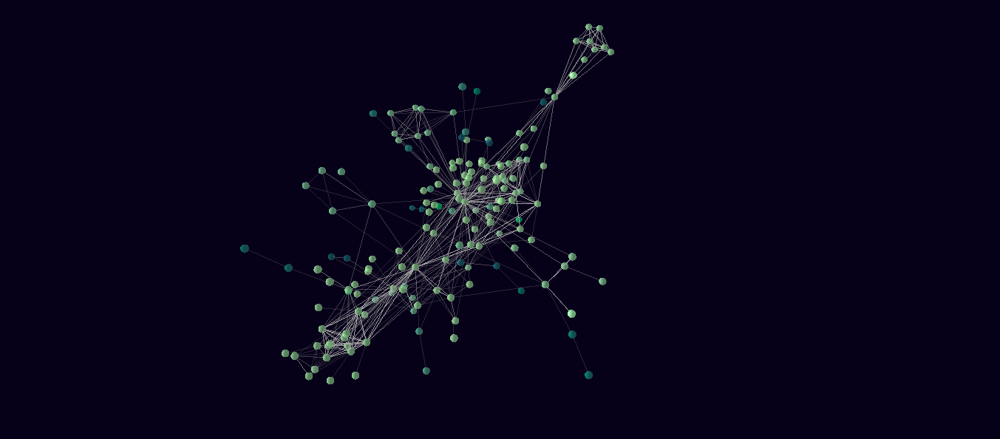

[](https://travis-ci.org/JohnCoene/n3d)

# n3d

3D networks in R.

## Installation

``` r
# install.packages("remotes")
remotes::install_github("JohnCoene/n3d")
```

## Example

``` r
library(n3d)

n3d() %>% 
	n_nodes(lesmis_nodes, id, color, size = out_degree) %>% 
	n_edges(lesmis_edges, source, target)
```


